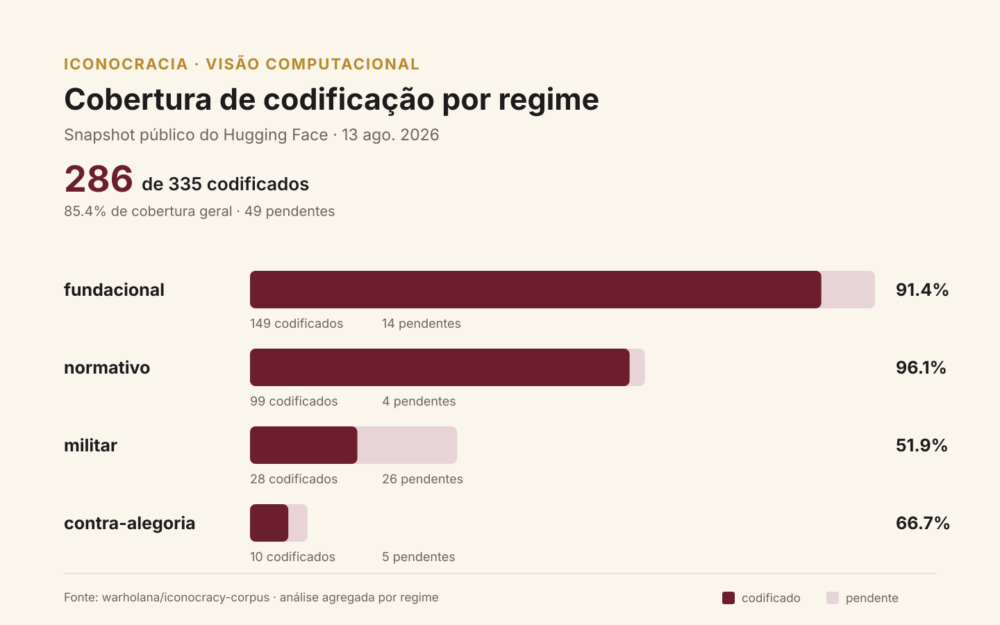

# Cobertura de codificação por regime iconocrático

Auditoria reproduzível do dataset público
[`warholana/iconocracy-corpus`](https://huggingface.co/datasets/warholana/iconocracy-corpus),
realizada em **2026-08-13** para apoio à disciplina **INE410159 / TRV410001 —
Visão Computacional (2026.2)**.

## Relação com o freeze da disciplina

O arquivo [`../../data/ICONOCRACIA-CV-2026-08-12.corpus-data.json`](../../data/ICONOCRACIA-CV-2026-08-12.corpus-data.json)
continua sendo o corpus congelado e imutável usado no trabalho da disciplina. Esta
análise usa o snapshot público do dia seguinte apenas como auditoria de cobertura;
ela não modifica nem substitui o freeze.

## Pergunta

Como as 49 observações ainda sem codificação de purificação se distribuem
entre os quatro regimes iconocráticos?

## Resultado

| Regime | Total | Codificados | Pendentes | Cobertura |
| --- | ---: | ---: | ---: | ---: |
| fundacional | 163 | 149 | 14 | 91,4% |
| normativo | 103 | 99 | 4 | 96,1% |
| militar | 54 | 28 | 26 | 51,9% |
| contra-alegoria | 15 | 10 | 5 | 66,7% |
| **Corpus** | **335** | **286** | **49** | **85,4%** |

O regime **militar** concentra 26 das 49 pendências (53,1%) e apresenta a menor
cobertura. Para experimentos de visão computacional, isso recomenda cautela ao
interpretar comparações entre regimes: a disponibilidade dos rótulos derivados é
desigual.



## Reproduzir

Pré-requisitos: Node.js e Python 3. O gráfico usa apenas a biblioteca padrão do
Python.

```bash
cd analysis/huggingface-regime-coverage-2026-08-13

CORPUS_PARQUET="hf://datasets/warholana/iconocracy-corpus"
CORPUS_PARQUET="${CORPUS_PARQUET}@~parquet/corpus/train/0000.parquet"
npx -y -p parquetlens -p @parquetlens/sql parquetlens \
  "$CORPUS_PARQUET" \
  --sql "$(tr '\n' ' ' < query.sql)"

python3 render_coverage.py
```

A consulta cria `tmp_coverage.csv`. O script valida os totais esperados, promove
esse arquivo a `coverage.csv` e regenera `coverage.svg`.

## Proveniência e limite metodológico

- Dataset público: `warholana/iconocracy-corpus`.
- Commit do dataset no Hugging Face: `bc5ccb2f3141b2331fcef8009a7fb4efd2b5fe8d`.
- Merge da análise no corpus-fonte: `3b0275a89b53b457af071fae271587427f75b18c`.
- Tabelas consultadas: splits Parquet `corpus` e `purification`.
- O split `corpus` usa UUIDs; o split `purification`, identificadores públicos como
  `AR-001`. Sem uma chave comum publicada, a comparação é agregada por regime e
  não constitui uma junção item a item.

## Arquivos

- `query.sql` — cálculo agregado diretamente sobre os Parquets públicos.
- `coverage.csv` — resultado tabular versionado.
- `render_coverage.py` — validação e geração do gráfico sem dependências externas.
- `coverage.svg` — figura vetorial pronta para notebooks, slides e relatórios.
